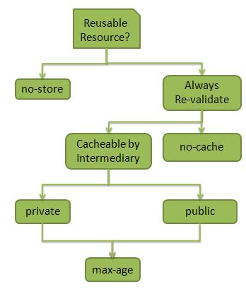

# RESTful Web 服务之缓存

缓存是指在客户端存储服务器响应，以便客户端不需要一次又一次的请求服务器上相同的资源。服务器响应应该有关于如何进行缓存的信息，以便客户端缓存一段时间内的响应或者永远不缓存服务器响应。

下面是可以用来配置客户端缓存的服务器响应头：

<table>
	<tbody>
		<tr>
			<th>
				编号
			</th>
			<th>
				头信息 &amp; 描述
			</th>
		</tr>
		<tr>
			<td>
				1
			</td>
			<td>
				<b>
					Date
				</b>
				 
				创建资源的日期和时间。
			</td>
		</tr>
		<tr>
			<td>
				2
			</td>
			<td>
				<b>
					Last Modified
				</b>
				 
				最后修改资源的日期和时间。
			</td>
		</tr>
		<tr>
			<td>
				3
			</td>
			<td>
				<b>
					Cache-Control
				</b>
				 
				控制缓存的主要头信息。
			</td>
		</tr>
		<tr>
			<td>
				4
			</td>
			<td>
				<b>
					Expires
				</b>
				 
				缓存到期的日期和时间。
			</td>
		</tr>
		<tr>
			<td>
				5
			</td>
			<td>
				<b>
					Age
				</b>
				 
				从服务器获取资源持续的秒数。
			</td>
		</tr>
	</tbody>
</table>

## Cache-Control Header

下面是 Cache-Control 头详情：

<table>
	<tbody>
		<tr>
			<th>
				编号
			</th>
			<th>
				指令 &amp; 描述
			</th>
		</tr>
		<tr>
			<td>
				1
			</td>
			<td>
				<b>
					Public
				</b>
				 
				表明该资源可由任何组件缓存。
			</td>
		</tr>
		<tr>
			<td>
				2
			</td>
			<td>
				<b>
					Private
				</b>
				 
				表明该资源只能由客户端和服务器缓存，没有中介可以缓存该资源。
			</td>
		</tr>
		<tr>
			<td>
				3
			</td>
			<td>
				<b>
					no-cache/no-store
				</b>
				 
				表明该资源不可缓存。
			</td>
		</tr>
		<tr>
			<td>
				4
			</td>
			<td>
				<b>
					max-age
				</b>
				 
				表明缓存在 max-age 指定的秒数内有效。之后，客户端就必须发起另一个请求。
			</td>
		</tr>
		<tr>
			<td>
				5
			</td>
			<td>
				<b>
					must-revalidate
				</b>
				 
				表明如果 max-age 已经过去了服务器要重新验证资源。
			</td>
		</tr>
	</tbody>
</table>

## 最佳实践

- 始终保持静态内容比如图像，CSS，JavaScript 可缓存，设置到期日期为 2 到 3 天。
- 永远不要保持过长的有效期。
- 动态内容应该只缓存几个小时。

