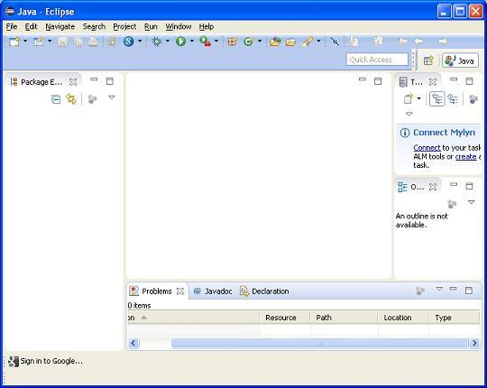
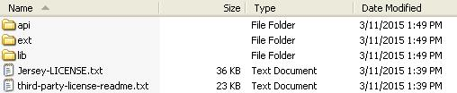
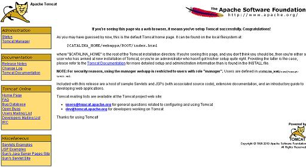

# RESTful Web 服务环境设置

本教程将会指导我们如何准备开发环境，使用 Jersey 框架启动我们的工作以创建一个 RESTful Web 服务。Jersey 框架实现了 __JAX-RS 2.0__ API，这是创建 RESTful Web 服务的标准规范。在安装 Jersey 框架之前本教程还会教授我们如何在我们的机器上安装 JDK，Tomcat 和 Eclipse：

## 步骤 1 - 安装 Java 开发工具包（JDK）：

我们可以从 Oracle 的 Java 站点的 [下载 Java SE](http://www.oracle.com/technetwork/java/javase/downloads/index.html) 页面下载最新版的 SDK。在下载的文件中可以找到安装 JDK 的说明，然后按照给定的说明安装和配置设置即可。最后，设置 PATH 和 JAVA_HOME 环境变量指向包含 java 和 javac 的目录，通常分别是 java_install_dir/bin 和 java_install_dir 目录。

如果你运行的是 Windows 并在 C:\jdk1.7.0_75 中安装了 JDK，那么你必须把下面的代码放到你的 C:\autoexec.bat 文件中。

```
set PATH=C:\jdk1.7.0_75\bin;%PATH%
set JAVA_HOME=C:\jdk1.7.0_75
```

或者，在 Windows NT/2000/XP 中，也可以右键我的电脑，选择属性，然后选择高级，最后选择环境变量。然后，更新 PATH 的值并按下 OK 按钮。

在 Unix（Solaris, Linux 等等）中，如果在 /usr/local/jdk1.7.0_75 中安装了 JDK 并使用的是 C Shell，你需要把下面的代码放到你的 .cshrc 文件中。

```
setenv PATH /usr/local/jdk1.7.0_75/bin:$PATH
setenv JAVA_HOME /usr/local/jdk1.7.0_75
```

或者，如果你使用集成开发环境（IDE），比如 Borland JBuilder， Eclipse,，IntelliJ IDEA 或者 Sun ONE Studio，请编译和运行一个简单的程序确认你的 IDE 知道你在哪里安装了 Java，否则请按照给定的文档对你的 IDE 做适当的设置。

## 步骤 2 - 安装 Eclipse IDE

本教程中的所有示例都是使用 Eclipse IDE 编写的。因此，我建议你在你的机器上安装最新版的 Eclipse。

要安装 Eclipse IDE，首先要从 [http://www.eclipse.org/downloads/](http://www.eclipse.org/downloads/) 下载最新的 Eclipse 二进制文件。下载安装文件之后，解压二进制文件到某个方便的位置。比如 Windows 的 C:\eclipse 或者 Linux/Unix 的 /usr/local/exlipse 中，最后适当的设置 PATH 变量即可。

在 Windows 上可以通过执行如下命令或者简单的双击 eclipse.exe 启动 Eclipse。

```
%C:\eclipse\eclipse.exe
```

在 Unix（Solaris，Linux 等）机器上可以通过执行如下命令启动 Eclipse：

```
$/usr/local/eclipse/eclipse
```

启动成功之后，如果一切顺利，那么它应该显示如下所示结果：



## 步骤 3 - 安装 Jersey 框架库

现在如果一切就绪，然后就可以安装 Jersey 框架了。以下是在你的机器上下载和安装这个框架的简单步骤。

- 选择是要在 Windows 上还是 Unix 上安装 Jersey，然后根据下一步为 Windows 下载 .zip 文件或者为 Unix 下载 .tz 文件。
- 从 [https://jersey.java.net/download.html](https://jersey.java.net/download.html) 下载最新版的 Jersey 框架二进制文件。
- 编写本教程时，我在我的 Windows 机器上下载的 __jaxrs-ri-2.17.zip__，解压下载的文件时它会在 E:\jaxrs-ri-2.17\jaxrs-ri 目录中生成如下所示的目录结构：



我们可以在 __C:\jaxrs-ri-2.17\jaxrs-ri\lib__ 目录找到所有的 Jersey 库，在 __C:\jaxrs-ri-2.17\jaxrs-ri\ext__ 中找到依赖。确保在这个目录正确设置了 CLASSPATH 变量，否则在运行应用程序时将会面临一些问题。如果你在使用 Eclipse，那么就不需要设置 CLASSPATH，因为所有的设置都会通过 Eclipse 完成。

## 步骤 4 - 安装 Apache Tomcat：

可以从 __[http://tomcat.apache.org/](http://tomcat.apache.org/)__ 上下载最新版的 Tomcat。下载安装文件之后，解压二进制文件到一个方便的位置。比如 Windows 的 C:\apache-tomcat-7.0.59 或者 Linux/Unix 的 /usr/local/apache-tomcat-7.0.59，然后设置 CATALINA_HOME 环境变量指向安装位置。

Windows 上可以通过执行如下命令或者简单的双击 startup.bat 文件启动 Tomcat：

```
%CATALINA_HOME%\bin\startup.bat
 
或者
 
C:\apache-tomcat-7.0.59\bin\startup.bat
```

Unix（Solaris，Linux 等）机器上可以通过执行如下命令启动 Tomcat：

```
$CATALINA_HOME/bin/startup.sh

或者

/usr/local/apache-tomcat-7.0.59/bin/startup.sh
```

成功启动之后，可以通过访问 __http://localhost:8080/__ 查看 Tomcat 包含的默认 Web 应用程序。如果一切就绪，那么它应该显示如下结果：



关于配置和运行 Tomcat 的更多信息可以在包含的文章中找到，也可以在 Tomcat 的网页：http://tomcat.apache.org 上找到。

Windows 机器上可以通过执行如下命令停止 Tomcat：

```
%CATALINA_HOME%\bin\shutdown

或者

C:\apache-tomcat-7.0.59\bin\shutdown
```

Unix（Solaris，Linux 等）机器上可以通过执行如下命令停止 Tomcat：

```
$CATALINA_HOME/bin/shutdown.sh

或者

/usr/local/apache-tomcat-7.0.59/bin/shutdown.sh
```

一旦完成最后这一步，就可以开始准备下一章会看到的第一个 Jersey 示例了。