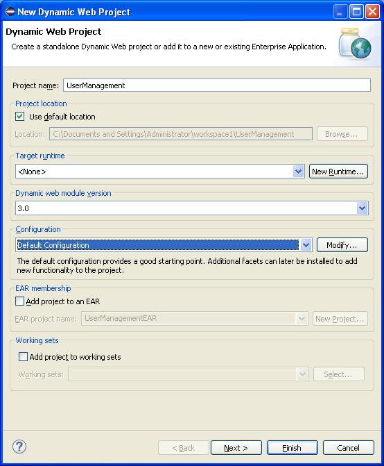
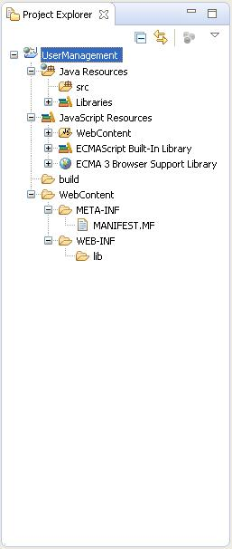
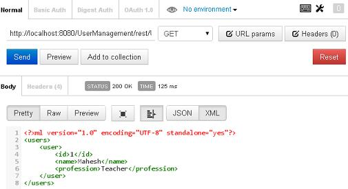

# 第一个 RESTful Web 服务应用

接下来我们开始使用 Jersey 框架编写真实的 RESTful Web 服务。在开始使用 Jersey 框架编写第一个示例之前，必须确保正确设置了 Jersey 环境，正如 [RESTful Web 服务环境设置]()教程中所阐述的。我还假设你掌握了一点点使用 Eclipse IDE 的基础知识。

那么，让我们开始编写一个简单的 Jersey 应用程序吧，它将暴漏一个 Web 服务方法来显示用户列表。

## 步骤 1 - 创建 Java 项目：

第一步是使用 Eclipse IDE 创建一个动态 Web 项目。遵循选项 __File -> New -> Project__，最后在向导列表中选择 __Dynamic Web Project__ 向导。然后在如下所示的向导窗口中将项目命名为 __UserManagement__：



一旦项目创建成功，在 __Project Explorer__ 中就会得到如下所示的目录结构：



## 步骤 2 - 添加需要的库：

我们把在项目中添加 Jersey 框架和它的依赖（库）作为第二步。从下面下载的 jersey zip 文件夹目录中把所有的 jars 复制到项目的 WEB-INF/lib 目录中。

- \jaxrs-ri-2.17\jaxrs-ri\api
- \jaxrs-ri-2.17\jaxrs-ri\ext
- \jaxrs-ri-2.17\jaxrs-ri\lib

首先，右击项目名 __UserManagement__，选择上下文菜单中的选项：__Build Path -> Configure Build Path__ 显示 Java Build Path 窗口。

最后使用 __Libraries__ 选项卡下面的 __Add JARs__ 按钮把 JARs 文件添加到  WEB-INF/lib 目录中。

## 步骤 3 - 创建源代码文件：

现在，让我们在 __UserManagement__ 项目下创建真实的源代码文件。首先我们需要创建一个叫做 __com.tutorialspoint__ 的包。要做到这一点，在包管理器中的 __src__ 上右击并遵循选项：__New -> Package__。

接下来我们会在 com.tutorialspoint 包下面创建 __User.java，UserDao.java 以及 UserService.java__ 文件。

_User.java 文件_

```
package com.tutorialspoint;

import java.io.Serializable;

import javax.xml.bind.annotation.XmlElement;
import javax.xml.bind.annotation.XmlRootElement;
@XmlRootElement(name = "user")
public class User implements Serializable {

   private static final long serialVersionUID = 1L;
   private int id;
   private String name;
   private String profession;

   public User(){}
   
   public User(int id, String name, String profession){
      this.id = id;
      this.name = name;
      this.profession = profession;
   }

   public int getId() {
      return id;
   }

   @XmlElement
   public void setId(int id) {
      this.id = id;
   }
   public String getName() {
      return name;
   }
   @XmlElement
   public void setName(String name) {
      this.name = name;
   }
   public String getProfession() {
      return profession;
   }
   @XmlElement
   public void setProfession(String profession) {
      this.profession = profession;
   }		
}
```

_UserDao.java 文件_

下面的程序已经被硬编码以显示用户清单相关的功能。这里我们可以实现可能从数据库或者任意资源中选择用户或者其他所需数据需要的业务逻辑。

```
package com.tutorialspoint;

import java.io.File;
import java.io.FileInputStream;
import java.io.FileNotFoundException;
import java.io.FileOutputStream;
import java.io.IOException;
import java.io.ObjectInputStream;
import java.io.ObjectOutputStream;
import java.util.ArrayList;
import java.util.List;

public class UserDao {
   public List<User> getAllUsers(){
      List<User> userList = null;
      try {
         File file = new File("Users.dat");
         if (!file.exists()) {
            User user = new User(1, "Mahesh", "Teacher");
            userList = new ArrayList<User>();
            userList.add(user);
            saveUserList(userList);		
         }
         else{
            FileInputStream fis = new FileInputStream(file);
            ObjectInputStream ois = new ObjectInputStream(fis);
            userList = (List<User>) ois.readObject();
            ois.close();
         }
      } catch (IOException e) {
         e.printStackTrace();
      } catch (ClassNotFoundException e) {
         e.printStackTrace();
      }		
      return userList;
   } 
}
```

_UserService.java 文件_

```
package com.tutorialspoint;

import java.util.List;

import javax.ws.rs.GET;
import javax.ws.rs.Path;
import javax.ws.rs.Produces;
import javax.ws.rs.core.MediaType;

@Path("/UserService")
public class UserService {

   UserDao userDao = new UserDao();

   @GET
   @Path("/users")
   @Produces(MediaType.APPLICATION_XML)
   public List<User> getUsers(){
      return userDao.getAllUsers();
   }	
}
```

这里有两个关于主程序需要注意的要点，UserService.java：

1. 第一步是使用 @Path 注释 UserService 给 Web 服务指定一个路径。
2. 第二步是使用 @Path 注释 UserService 方法给特定的 Web 服务方法指定一个路径。

## 步骤 4 - 创建 Web.xml 配置文件：

我们需要创建一个 Web.xml 配置文件，这是一个 XML 文件，用于给我们的应用程序指定 Jersey 框架 servlet。

_web.xml 文件__

```
<?xml version="1.0" encoding="UTF-8"?>
<web-app xmlns:xsi="http://www.w3.org/2001/XMLSchema-instance" 
   xmlns="http://java.sun.com/xml/ns/javaee" 
   xsi:schemaLocation="http://java.sun.com/xml/ns/javaee 
   http://java.sun.com/xml/ns/javaee/web-app_3_0.xsd" 
   id="WebApp_ID" version="3.0">
   <display-name>User Management</display-name>
   <servlet>
      <servlet-name>Jersey RESTful Application</servlet-name>
      <servlet-class>org.glassfish.jersey.servlet.ServletContainer</servlet-class>
         <init-param>
            <param-name>jersey.config.server.provider.packages</param-name>
            <param-value>com.tutorialspoint</param-value>
         </init-param>
      </servlet>
   <servlet-mapping>
   <servlet-name>Jersey RESTful Application</servlet-name>
      <url-pattern>/rest/*</url-pattern>
   </servlet-mapping>  
</web-app>
```

## 步骤 5 - 部署程序

一旦完成源代码和 Web 配置文件创建，就可以进入编译和运行程序这一步。要做到这一点，使用 Eclipse 将应用程序导出为一个 war 文件并部署到 Tomcat 中即可。要使用 eclipse 创建 WAR 文件，遵循选项 __File -> export -> Web -> War File__，最后选择项目 UserManagement 和目标文件夹即可。要在 Tomcat 中部署 war 文件，把 UserManagement.war 放到 Tomcat 安装目录的 webapps 目录中并启动 Tomcat 即可。

## 步骤 6 - 运行程序

我们使用 __[Postman](http://www.getpostman.com/)__ 来测试我们的 Web 服务，这是一个 Chrome 扩展。

建立一个到 UserManagement 获取所有用户列表的请求。把 http://localhost:8080/UserManagement/rest/UserService/users 放到 POSTMAN 中选择 GET 请求，可以看到下面的结果。



恭喜，你已经成功创建你的第一个 RESTful 应用程序了。为了更进一步，让我们在接下来的几个章节中做一些有趣的事情。