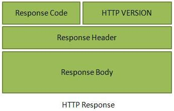

# RESTful Web 服务之消息

RESTful Web 服务使用 HTTP 协议作为客户端和服务器之间的通信媒介。客户端发送一个 HTTP 请求形式的消息，然后服务器按照 HTTP 响应形式的响应。这种技术被称为消息传递。这些消息包含消息数据和元数据，比如消息本身相关的信息。我们来看看 HTTP 1.1 中的 HTTP 请求和 HTTP 消息响应。

## HTTP 请求

一个 HTTP 请求有五个主要部分：

- __动作（Verb）__ - 表明 HTTP 方法，比如 GET，POST，DELETE，PUT 等等。
- __URI__ - 用来标识服务器上资源的统一资源标示符（URI）。
- __HTTP 版本__ - 表明 HTTP 版本，比如 HTTP v1.1。
- __请求头__ - 包含 HTTP 请求消息的元数据，它是键-值对形式的。比如，客户端（或者浏览器）类型，客户端支持的格式，消息体格式，缓存设置等等。
- __请求体__ - 消息内容或者资源表示形式。

## HTTP 响应

HTTP 响应有四个主要部分：

- __状态/响应码__ - 表明请求资源的服务器状态。比如 404 意味着资源没有找到或者 200 意味着响应 OK。
- __HTTP 版本__ - 表明 HTTP 版本，比如 HTTP v1.1。
- __响应头__ - 包含 HTTP 响应消息的元素数据，它是键-值对形式的。比如，内容长度，内容类型，响应日期，服务器类型等等。
- __响应体__ - 响应消息内容或者资源表示形式。

## 示例

正如 __第一个 RESTful Web 服务应用程序[first-application.md]__教程中所阐述的。让我们把 http://localhost:8080/UserManagement/rest/UserService/users  放到 POSTMAN 中并设置为 GET 请求。如果我们点击 Postman 发送按钮附近的预览按钮，然后点击发送按钮，你可能看到如下所示输出：

这里可以看到，浏览器发送了一个 GET 请求并收到一个 XML 形式的响应体。